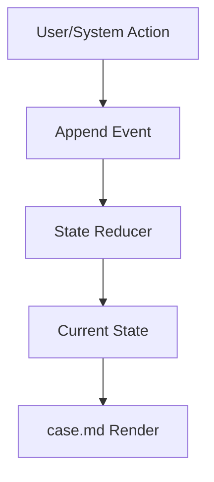
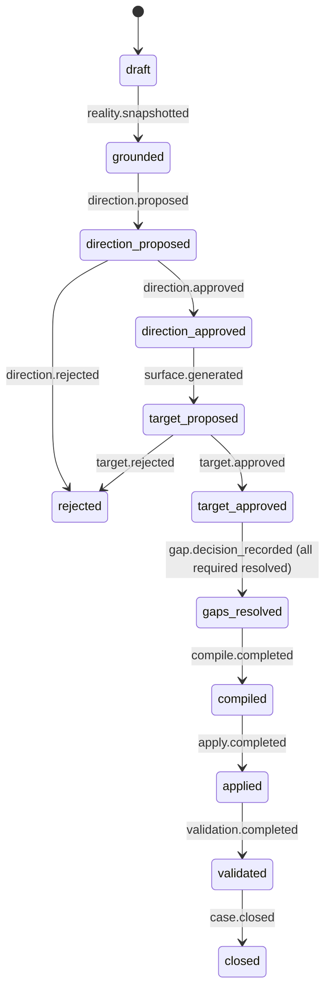

# Event Log Contract

## 목적

`events.ndjson`는 Change Case의 정본이다.

이 파일은 모든 상태 변화를 append-only 방식으로 기록한다.
즉 과거 이벤트를 고치지 않고, 새 이벤트를 계속 뒤에 추가한다.

이 방식의 목적은 세 가지다.

1. 상태를 재구성할 수 있게 한다
2. 판단과 승인 이력을 추적할 수 있게 한다
3. `case.md`를 직접 수정하지 않고도 현재 상태를 만들 수 있게 한다

## 위치

각 Change Case의 이벤트 로그는 아래에 존재한다.

```text
cases/{change-id}/events.ndjson
```

이 파일은 한 줄에 하나의 JSON object를 가진다.

## 왜 `events.ndjson`가 정본인가

이 시스템은 사람이 `JP1`, `JP2`에서 판단하고,
시스템이 compile, apply, validate를 수행한다.

이 모든 과정을 나중에 설명하려면,
"현재 상태"만 있어서는 부족하고
"어떤 사건을 거쳐 여기 왔는가"가 남아 있어야 한다.

그래서 정본은 요약 문서가 아니라 이벤트 로그여야 한다.



## 기본 원칙

1. 이벤트는 append-only다
2. 기존 이벤트를 수정하지 않는다
3. 현재 상태는 이벤트를 reduce해서 만든다
4. `case.md`는 이벤트에서 렌더한다
5. 상태 전이는 이벤트 계약을 따라야 한다

## 한 줄 구조

한 이벤트는 대략 이런 형태를 가진다.

```json
{
  "event_id": "evt_001",
  "change_id": "CC-2026-001",
  "type": "direction.approved",
  "ts": "2026-03-07T10:30:00Z",
  "revision": 7,
  "actor": "user",
  "stage": "jp1",
  "payload": {
    "approved_by": "Product Owner",
    "summary": "Direction approved with one scope limit"
  }
}
```

## 공통 필드 계약

모든 이벤트는 아래 필드를 가진다.

| 필드 | 의미 |
|------|------|
| `event_id` | 이벤트 고유 ID |
| `change_id` | 어떤 Change Case에 속하는지 |
| `type` | 이벤트 종류 |
| `ts` | 발생 시각 |
| `revision` | 순차 revision 번호 |
| `actor` | `user`, `system`, `agent` 중 하나 |
| `stage` | `ground`, `jp1`, `jp2`, `compile`, `apply`, `validate` 등 |
| `payload` | 이벤트별 상세 내용 |

## 이벤트 타입 분류

v1에서는 이벤트 타입을 너무 잘게 쪼개지 않는다.
아래 정도면 충분하다.

### 1. Case / Input

- `case.created`
- `input.attached`
- `case.mode_selected`

### 2. Grounding

- `grounding.started`
- `evidence.recorded`
- `reality.snapshotted`
- `snapshot.marked_stale`

### 3. Direction / JP1

- `direction.proposed`
- `direction.revised`
- `direction.approved`
- `direction.rejected`

### 4. Target / JP2

- `surface.generated`
- `surface.revised`
- `gap.collected`
- `gap.decision_recorded`
- `target.approved`
- `target.revised`
- `target.rejected`

### 5. Compile / Execution

- `compile.started`
- `compile.blocked`
- `compile.completed`
- `execution.pack_generated`
- `apply.completed`
- `validation.completed`
- `case.closed`

## 왜 이벤트 타입을 도메인 이름으로 쓰는가

`jp1.approved`보다 `direction.approved`,
`jp2.approved`보다 `target.approved`가 더 오래 간다.

이유는:

- 단계 이름이 바뀌어도 도메인 의미는 유지되기 때문
- 상태 reducer가 더 읽기 쉬워지기 때문

즉 이벤트는 화면 이름보다 도메인 의미를 중심으로 잡는다.

## 주요 이벤트 예시

### `case.created`

```json
{
  "type": "case.created",
  "payload": {
    "title": "Tutor Block Change",
    "entry_mode": "discovery",
    "change_class": ["experience_change"]
  }
}
```

### `reality.snapshotted`

```json
{
  "type": "reality.snapshotted",
  "payload": {
    "snapshot_revision": 5,
    "system_scope": "student reservation and tutor matching",
    "sources": [
      {"kind": "repo", "ref": "backend/services/tutor"},
      {"kind": "doc", "ref": "inputs/brief.md"}
    ]
  }
}
```

### `direction.approved`

```json
{
  "type": "direction.approved",
  "payload": {
    "approved_baseline_id": "dir_v2",
    "summary": "Proceed with future-matching exclusion only"
  }
}
```

### `gap.decision_recorded`

```json
{
  "type": "gap.decision_recorded",
  "payload": {
    "gap_id": "gap_003",
    "decision": "inject",
    "rationale": "preserve existing reservation trust"
  }
}
```

### `compile.blocked`

```json
{
  "type": "compile.blocked",
  "payload": {
    "reason": "snapshot_stale",
    "details": [
      "backend schema changed after target approval"
    ]
  }
}
```

## 상태 전이와 이벤트 관계

이벤트는 상태를 설명할 뿐 아니라, 상태를 움직인다.



## Reducer가 이 로그로 하는 일

Reducer는 이벤트를 읽고 현재 상태를 만든다.

예를 들어:

- 최신 `direction.approved`가 있으면 방향은 승인 상태다
- `snapshot.marked_stale`가 있고 최신 snapshot보다 뒤면 compile은 막혀야 한다
- `gap.decision_recorded`가 다 모이지 않았으면 compile_ready는 false다

즉 이벤트는 단순 기록이 아니라 현재 상태를 계산하는 재료다.

## 잘못된 사용 예

이런 방식은 피해야 한다.

- 이벤트를 건너뛰고 `case.md`만 수정
- 과거 이벤트를 덮어쓰기
- revision 없이 이벤트 추가
- `payload` 안에 너무 많은 의미를 한꺼번에 몰아 넣기

이렇게 되면:

- 상태 재구성이 어려워지고
- 승인 이력 추적이 무너지고
- `case.md`와 실제 상태가 어긋나기 쉽다

## 좋은 이벤트 로그의 특징

- 이벤트 이름이 도메인 의미를 드러낸다
- revision이 순서대로 증가한다
- payload가 현재 이벤트 의미에만 집중한다
- 상태 전이 규칙과 잘 맞는다

## 완료 판정

`events.ndjson` 계약은 아래 상태면 충분히 고정된 것이다.

- 새 이벤트를 추가하는 것만으로 상태를 바꿀 수 있다
- reducer가 현재 상태를 안정적으로 재구성할 수 있다
- 승인 이력과 blocker 이력을 추적할 수 있다
- `case.md`를 자동 렌더링할 수 있다

아래 상태면 아직 미완료다.

- "현재 상태는 알지만 어떻게 왔는지 모른다"
- "승인 이력이 섞여서 추적이 안 된다"
- "case.md를 직접 고쳐야 상태가 맞는다"

그 상태면 event-sourced 구조라고 보기 어렵다.
