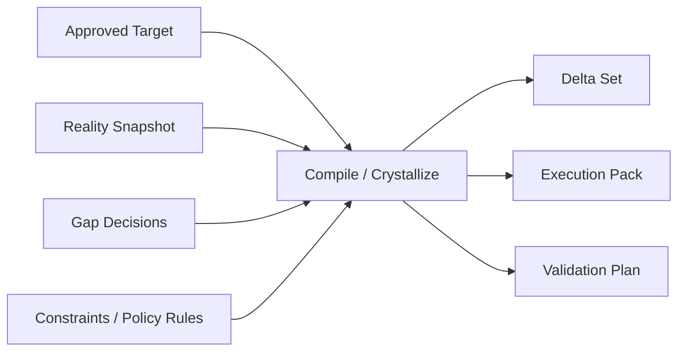
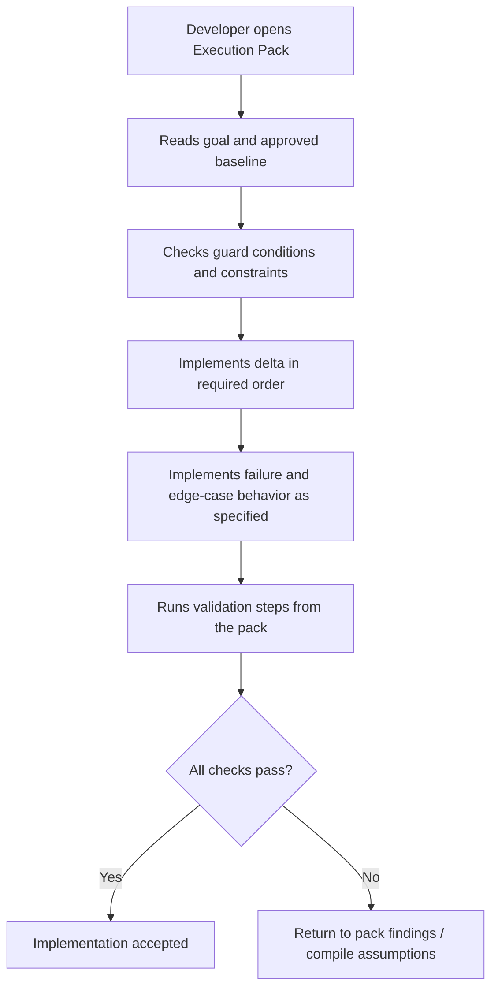

# Execution Pack Template

## 목적

`Execution Pack`은 개발자가 구현 중에 다시 제품 판단을 하지 않아도 되게 만드는 최종 구현 기준서다.

이 문서는 단순한 작업 목록이 아니다.
이 문서는 아래를 미리 결정해 둔 상태여야 한다.

- 정상 동작
- 오류 동작
- 경계 조건
- 정책 보존 규칙
- 금지 동작
- 대안 경로
- 검증 기준

즉 개발자는 `Execution Pack`을 보고:

- 무엇을 만들어야 하는지
- 어떤 조건에서 막아야 하는지
- 어떤 오류를 어떻게 처리해야 하는지
- 어떤 정책을 절대 깨면 안 되는지
- 어떤 경우에 대안을 따라야 하는지

를 다시 설계하지 않고 구현할 수 있어야 한다.

## 위치

각 Change Case의 실행 팩은 아래에 생성된다.

```text
cases/{change-id}/build/execution-pack.md
```

관련 파생 산출물:

- `cases/{change-id}/build/delta-set.json`
- `cases/{change-id}/build/validation-plan.md`

## 생성 시점

`Execution Pack`은 `JP2` 승인 이후, `compile / crystallize` 단계에서 생성된다.

입력은 다음과 같다.

- 승인된 target
- Reality Snapshot
- Evidence
- Gap Register의 결정 결과
- constraints와 policy-preserving rules



## 품질 기준

좋은 `Execution Pack`은 다음 질문에 모두 답해야 한다.

1. 무엇을 바꾸는가?
2. 어떤 순서로 바꾸는가?
3. 정상 케이스에서 어떤 동작이 나와야 하는가?
4. 실패/오류 상황에서 어떤 동작이 나와야 하는가?
5. 경계 조건에서 허용/차단 기준은 무엇인가?
6. 정책과 제약 중 무엇을 반드시 보존해야 하는가?
7. 주 경로가 불가능할 때 어떤 대안을 따르는가?
8. 무엇을 검증하면 구현이 맞다고 볼 수 있는가?

compile은 아래 중 하나라도 비어 있으면 완료로 보면 안 된다.

- implementation-critical edge case
- failure handling
- policy-preserving behavior
- fallback path
- validation criteria

## 템플릿 구조

아래 템플릿은 v1 기준 기본 구조다.

```md
# Execution Pack

## 1. Pack Identity
- change_id:
- revision:
- generated_at:
- compile_basis:
- approved_target_id:
- snapshot_revision:

## 2. Goal
- user-visible goal:
- implementation goal:
- non-goals:

## 3. Approved Target Baseline
- summary:
- source surface:
- linked JP2 verdict:
- approved hidden requirement decisions:

## 4. Delta Summary
- additions:
- modifications:
- removals:
- unchanged dependencies to preserve:

## 5. Preconditions and Guard Conditions
- required existing state:
- forbidden state:
- dependency assumptions:
- compile-time blockers:
- runtime blockers:

## 6. Canonical Behavior
### 6.1 Primary Flow
- step-by-step expected behavior

### 6.2 Alternate Valid Flows
- allowed alternate paths

## 7. Error and Failure Behavior
- expected user-facing errors:
- expected system-level failures:
- retry policy:
- stop conditions:
- escalation conditions:

## 8. Edge Case Decision Table
| Case | Trigger | Expected Behavior | Constraint/Policy Basis | Fallback |
|------|---------|-------------------|--------------------------|----------|

## 9. Policy and Constraint Preservation
- business rules to preserve:
- compatibility constraints:
- migration rules:
- security constraints:
- observability requirements:

## 10. Implementation Plan
- ordered work items:
- sequencing constraints:
- required artifacts to update:
- ownership hints:

## 11. Fallback and Rollback
- primary fallback:
- rollback trigger:
- rollback action:
- data protection notes:

## 12. Validation Plan
- happy-path checks:
- edge-case checks:
- policy-preservation checks:
- regression checks:
- completion criteria:
```

## 섹션별 설명

### 1. Pack Identity

이 팩이 어떤 승인 상태와 어떤 snapshot을 기준으로 생성되었는지 고정한다.
나중에 시스템 현실이 바뀌었을 때 stale 여부를 판단하는 기준이 된다.

### 2. Goal

왜 구현하는지와 무엇을 하지 않는지 분명히 적는다.
개발자가 구현 범위를 넓히지 않게 하는 장치다.

### 3. Approved Target Baseline

JP2에서 승인된 목표를 그대로 연결한다.
여기서부터 아래 구현 판단이 파생된다.

### 4. Delta Summary

실제로 바뀌는 요소를 요약한다.
개발자가 영향 범위를 빠르게 이해하는 기준점이다.

### 5. Preconditions and Guard Conditions

이 섹션은 중요하다.
무엇이 충족돼야 진행 가능한지, 어떤 상태에선 절대 진행하면 안 되는지를 적는다.

예:

- 이미 차단된 튜터를 다시 차단하려 하면 중복 생성 금지
- 기존 예약은 유지되어야 함
- 차단 한도 초과 시 생성 차단

### 6. Canonical Behavior

정상 동작을 정한다.
주 경로뿐 아니라 허용되는 대체 흐름도 같이 적는다.

이 섹션이 약하면 개발자가 “이 정도면 되겠지” 식으로 구현하게 된다.

### 7. Error and Failure Behavior

오류가 났을 때 무엇을 반환하고, 무엇을 기록하고, 어디서 멈춰야 하는지 명시한다.

여기서 중요한 건:

- 단순히 “에러 처리 필요”라고 적지 않는 것
- 어떤 조건에서 어떤 오류를 보여주고 어떤 상태를 유지할지까지 적는 것

### 8. Edge Case Decision Table

이 테이블이 핵심이다.
경계 조건마다 시스템이 어떤 결정을 따라야 하는지를 명시한다.

예:

| Case | Trigger | Expected Behavior | Constraint/Policy Basis | Fallback |
|------|---------|-------------------|--------------------------|----------|
| Duplicate block request | already blocked tutor | no-op or explicit error | duplicate prevention rule | return existing status |
| Active reservation exists | tutor has future reservation | preserve reservation, exclude future matching only | user trust policy | add notice |

### 9. Policy and Constraint Preservation

개발자가 구현 중 쉽게 깨뜨릴 수 있는 비가시적 규칙을 모아 둔다.

예:

- 기존 예약은 소급 취소 금지
- 특정 감사 로그는 남겨야 함
- 기존 API 응답 필드는 유지해야 함
- 차단 한도 정책 준수

### 10. Implementation Plan

실제 구현 순서를 적는다.
여기서도 단순 TODO가 아니라 순서 의존성까지 포함해야 한다.

### 11. Fallback and Rollback

주 경로가 막혔을 때 어떤 대안을 따를지 적는다.
실패 시 어디까지 되돌릴지와 데이터 보호 원칙도 포함한다.

### 12. Validation Plan

개발이 끝났는지 판단하는 기준이다.
happy path만이 아니라 edge case, 정책 보존, 회귀 영향까지 포함해야 한다.

## 개발자가 이 문서를 사용하는 방식



## 작성 원칙

`Execution Pack` 작성 시 반드시 지켜야 할 원칙:

1. 개발자가 다시 제품 결정을 내리게 만들지 않는다.
2. “적절히 처리” 같은 모호한 표현을 쓰지 않는다.
3. edge case는 나열이 아니라 `결정`으로 기록한다.
4. 정책은 참고사항이 아니라 구현 제약으로 기록한다.
5. fallback은 선택사항이 아니라 주 경로 실패 시 공식 경로로 적는다.
6. validation은 결과 확인이 아니라 구현 계약 검증이어야 한다.

## 완료 판정

`Execution Pack`은 아래 상태가 되어야 완료다.

- 개발자가 pack만 보고 구현 순서를 이해할 수 있다
- 개발자가 오류/예외 처리 결정을 새로 만들 필요가 없다
- 정책 위반 가능성이 pack 안에서 이미 차단된다
- 주요 edge case의 expected behavior가 명시돼 있다
- validation 기준만으로 구현 적합성을 판정할 수 있다

아래 상태면 아직 미완료다.

- “에러 처리는 개발 중 결정”
- “정책은 기존 코드 참고”
- “edge case는 필요시 대응”
- “fallback은 나중에 생각”

이런 문서는 `Execution Pack`이 아니라 단순 작업 초안이다.
