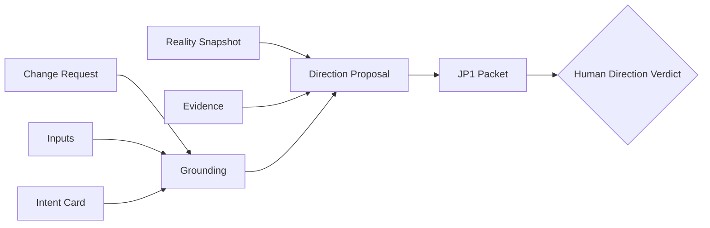
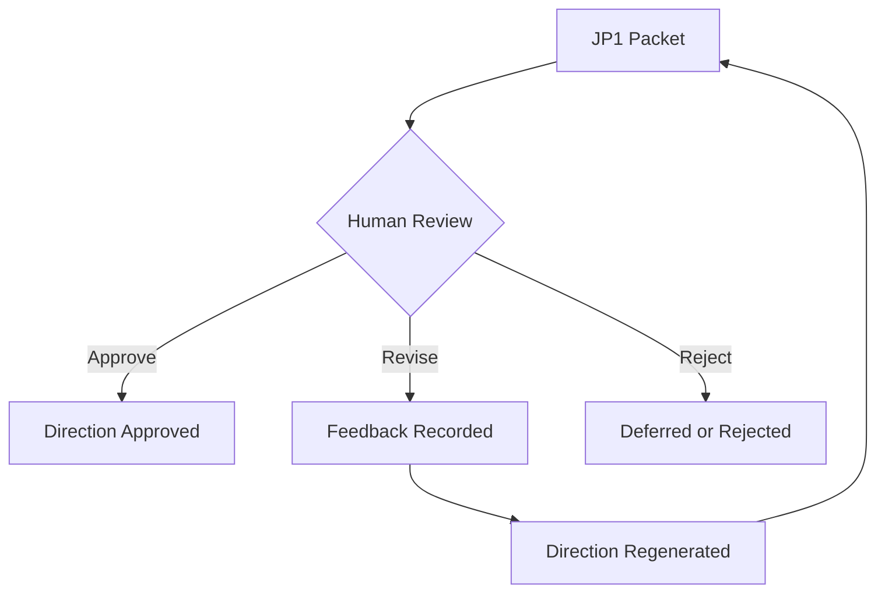

# JP1 Template

## 목적

`JP1`은 개발 전에 방향을 승인하는 판단 게이트다.

이 문서는 전통적인 의미의 완성형 PRD가 아니다.
이 문서는 사람이 아래 질문에 답할 수 있게 만드는 `Direction Packet`이다.

- 이 변경이 진짜 필요한가?
- 이 방향이 맞는가?
- 빠진 핵심 시나리오는 없는가?
- 이번 범위와 제외 범위가 맞는가?
- 지금 이 방향으로 `JP2`까지 진행해도 되는가?

즉 `JP1 문서`의 목적은 세부 구현을 정의하는 것이 아니라,
`잘못된 방향으로 preview를 만들지 않게 하는 것`이다.

## 위치

각 Change Case의 JP1 문서는 아래에 렌더된다.

```text
cases/{change-id}/build/jp1-packet.md
```

관련 원본과 파생물:

- `cases/{change-id}/events.ndjson`
- `cases/{change-id}/case.md`
- `cases/{change-id}/surface/` 는 아직 생성 전일 수 있음

## 생성 시점

`JP1`은 `/sprint-kit` 실행 이후, grounding이 끝난 다음 생성된다.

입력은 다음과 같다.

- change request
- inputs
- Intent Card
- Reality Snapshot
- Evidence
- initial direction proposal



## JP1이 반드시 해결해야 하는 것

좋은 `JP1 문서`는 다음 질문에 답할 수 있어야 한다.

1. 왜 이 변경을 하는가?
2. 누구를 위한 변경인가?
3. 현재 시스템 현실상 어디가 문제인가?
4. 어떤 사용자 시나리오를 해결하려는가?
5. 이번 변경의 범위는 어디까지인가?
6. 이번에 하지 않을 것은 무엇인가?
7. 방향상 남아 있는 불확실성은 무엇인가?
8. 사람이 지금 승인해야 할 판단은 정확히 무엇인가?

이 문서가 위 질문에 답하지 못하면, `JP2`로 넘어가면 안 된다.

## JP1이 다루지 않아야 하는 것

`JP1`은 아래를 깊게 다루지 않는다.

- 상세 구현 방식
- 파일 단위 변경 계획
- API 필드 레벨 상세
- migration 절차
- edge case별 코드 처리

그것들은 `JP2`와 `compile / execution pack`의 관심사다.

## 품질 기준

좋은 `JP1 문서`는 다음 상태여야 한다.

- 제품 전문가가 기술 지식 없이도 방향을 판단할 수 있다
- 현재 시스템 제약이 무시되지 않는다
- 사용자 시나리오가 추상 문장에 머물지 않는다
- 포함 범위와 제외 범위가 명확하다
- 승인하지 않으면 안 되는 미결정 방향 이슈가 드러난다

나쁜 `JP1 문서`는 보통 이런 특징이 있다.

- 문제 설명은 많은데 방향 선택지가 없다
- 현재 시스템 현실이 거의 없다
- 사용자 시나리오가 너무 추상적이다
- 범위가 무한정 열려 있다
- 읽고 나서도 “그래서 뭘 승인하면 되지?”가 남는다

## 기본 템플릿 구조

```md
# JP1 Packet

## 1. Packet Identity
- change_id:
- revision:
- generated_at:
- snapshot_revision:
- direction_proposal_id:

## 2. Why This Change Exists
- change request summary:
- business / user problem:
- why now:
- intended beneficiary:

## 3. Current Reality
- current behavior summary:
- relevant system constraints:
- already-existing related behavior:
- known risks from current state:

## 4. Evidence Summary
- key claims and supporting evidence:
- confidence notes:
- missing but non-blocking evidence:

## 5. Proposed Direction
- direction summary:
- proposed value:
- core approach:
- explicit non-goals:

## 6. User Scenario Set
- primary scenario:
- secondary scenarios:
- failure or frustration scenarios relevant to direction:

## 7. Scope and Boundaries
- in scope:
- out of scope:
- assumptions:
- dependencies:

## 8. Open Direction Questions
- unresolved direction issues:
- options:
- impact of each option:

## 9. Success Conditions
- observable success outcomes:
- minimum acceptable outcome:
- rejection conditions:

## 10. Decision Request
- what must be approved now:
- what can wait:
- approve / revise / reject guidance:
```

## 섹션별 설명

### 1. Packet Identity

이 문서가 어떤 grounding 결과를 기준으로 생성됐는지 고정한다.
나중에 snapshot이 오래되었는지 판단하는 근거가 된다.

### 2. Why This Change Exists

이 변경의 존재 이유를 설명한다.
단순히 “기능 추가 요청”이라고 쓰는 게 아니라,
왜 지금 이걸 해야 하는지와 누구에게 어떤 문제가 있는지 적어야 한다.

### 3. Current Reality

현재 시스템이 실제로 어떻게 동작하는지 요약한다.

이 섹션이 약하면, 방향은 맞아 보여도 실제 시스템과 충돌하는 방향을 승인하게 된다.

예:

- 이미 유사 기능이 일부 존재함
- 기존 플로우와 충돌 가능성이 있음
- 정책상 특정 행위는 허용되지 않음

### 4. Evidence Summary

JP1은 추측이 아니라 evidence 기반이어야 한다.
따라서 중요한 주장마다 근거가 있어야 한다.

예:

- “학생은 특정 튜터를 피하고 싶어 한다” → 회의록, VOC, support issue
- “기존 예약은 유지되어야 한다” → 정책 문서, 운영 규칙

### 5. Proposed Direction

여기서 시스템이 제안하는 해결 방향을 정리한다.

중요한 점:

- 구현안을 길게 설명하지 않는다
- 방향 수준의 선택지를 보여준다
- 왜 이 방향이 타당한지 적는다

### 6. User Scenario Set

JP1은 반드시 사용자 시나리오를 포함해야 한다.
그렇지 않으면 사람은 추상적인 찬반밖에 할 수 없다.

예:

- 학생이 수업 후 불쾌했던 튜터를 이후 매칭에서 제외하고 싶다
- 학생이 block 관리 화면에서 기존 차단 목록을 보고 해제할 수 있다

### 7. Scope and Boundaries

이 변경이 어디까지를 다루고, 어디까지는 다루지 않는지를 적는다.

예:

- in scope: future matching exclusion
- out of scope: past reservation cancellation

이 섹션이 약하면 구현 범위가 계속 커진다.

### 8. Open Direction Questions

여기에는 아직 확정되지 않았지만 방향에 영향을 주는 질문을 적는다.

예:

- 차단 가능한 수를 언어별로 제한할 것인가?
- 차단 후 즉시 안내 메시지를 보여줄 것인가?

이건 “나중에 생각하자”가 아니라, JP1에서 판단해야 하는 방향 질문인지 아닌지를 구분하는 섹션이다.

### 9. Success Conditions

무엇이 되면 이번 방향이 성공인지 적는다.

좋은 기준은 관찰 가능해야 한다.
즉 “좋은 경험 제공”보다는
“학생이 future matching에서 해당 튜터를 다시 보지 않는다” 같은 표현이어야 한다.

### 10. Decision Request

이 섹션이 가장 중요하다.
사람이 지금 무엇을 승인해야 하는지를 명확히 적는다.

예:

- 이 문제 정의를 승인하는가?
- 이 방향과 범위를 승인하는가?
- 누락된 시나리오가 있는가?
- 이 상태로 JP2 preview 제작을 시작해도 되는가?

## 사람이 JP1에서 실제로 하는 일

사람은 문서를 읽고 아래 중 하나를 선택한다.

- `Approve`
- `Revise`
- `Reject`



## JP1 피드백의 형태

좋은 JP1 피드백은 보통 아래 중 하나다.

- 빠진 사용자 시나리오 추가 요청
- 범위 축소 또는 확대 요청
- 우선순위 조정 요청
- 현재 시스템 현실과 충돌하는 방향 수정 요청
- 승인권자 관점에서 unacceptable한 방향 거절

나쁜 피드백은 보통 이런 형태다.

- “뭔가 별로”
- “더 좋아지면 좋겠음”
- “알아서 잘”

`JP1 문서`는 나쁜 피드백을 줄이고, 구체적 판단을 끌어내야 한다.

## 작성 원칙

1. 구현이 아니라 방향을 설명한다.
2. 추상 개념이 아니라 사용자 시나리오로 보여준다.
3. 현재 시스템 현실을 반드시 포함한다.
4. 범위와 제외 범위를 명시한다.
5. evidence 없는 강한 주장은 피한다.
6. 마지막에는 반드시 “지금 무엇을 승인해야 하는지”를 적는다.

## 완료 판정

`JP1 문서`는 아래 상태면 완료다.

- 제품 전문가가 이 문서만 보고 방향 승인 여부를 결정할 수 있다
- preview를 만들 가치가 있는지 판단 가능하다
- 현재 시스템과 충돌하는 큰 방향 오류가 드러나 있다
- 빠진 시나리오와 범위 이슈를 말할 수 있다

아래 상태면 아직 미완료다.

- “문제는 알겠는데 방향이 안 보임”
- “현재 시스템이 어떤 상태인지 모르겠음”
- “무엇이 범위인지 모르겠음”
- “승인하면 정확히 뭐가 진행되는지 모르겠음”

그 상태에서는 `JP2`로 가면 안 된다.
