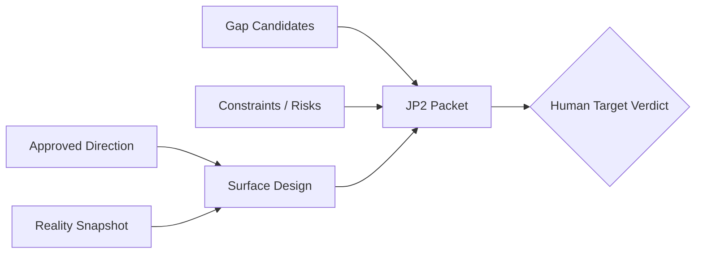
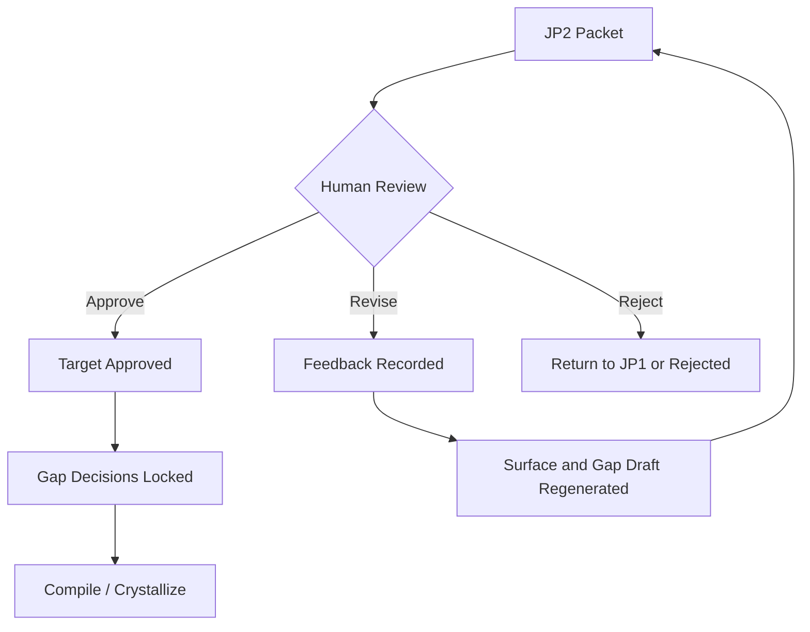

# JP2 Template

## 목적

`JP2`는 목표 결과물을 승인하는 판단 게이트다.

이 단계의 핵심은 단순히 preview를 보는 것이 아니다.
이 단계에서는 아래를 함께 끝내야 한다.

- concrete target이 맞는지 판단
- 사용자 경험 또는 계약 결과물이 맞는지 판단
- hidden requirement를 어떻게 처리할지 결정
- risk와 tradeoff를 감수할지 결정
- 이 상태로 compile / crystallize를 진행해도 되는지 결정

즉 `JP2 패킷`은 `Target Packet`이다.
이 문서는 사람이 아래 질문에 답할 수 있게 만들어야 한다.

- 이 결과물이 내가 원하는 최종 모습인가?
- preview나 contract diff에 빠진 것이 없는가?
- surface에는 안 보이지만 반드시 반영해야 할 제약은 무엇인가?
- 이 제약과 리스크를 감수하고 다음 단계로 가도 되는가?

## 위치

각 Change Case의 JP2 패킷은 아래에 렌더된다.

```text
cases/{change-id}/build/jp2-packet.md
```

관련 원본과 파생물:

- `cases/{change-id}/surface/`
- `cases/{change-id}/events.ndjson`
- `cases/{change-id}/case.md`
- `cases/{change-id}/build/execution-pack.md` 는 아직 생성 전일 수 있음

## 생성 시점

`JP2`는 `JP1` 방향 승인 이후 생성된다.

입력은 다음과 같다.

- approved direction baseline
- concrete surface
- Gap Register draft
- hidden requirement candidates
- risks and tradeoffs
- relevant constraints



## JP2가 반드시 해결해야 하는 것

좋은 `JP2 패킷`은 다음 질문에 답할 수 있어야 한다.

1. 실제 판단 대상이 무엇인가?
2. 이 결과물이 사용자 입장에서 어떻게 달라지는가?
3. concrete surface에 보이지 않는 중요한 요구사항은 무엇인가?
4. 각 hidden requirement는 inject, defer, reject 중 무엇으로 처리할 것인가?
5. 어떤 risk와 tradeoff가 남아 있는가?
6. 사람이 지금 무엇을 승인해야 하는가?
7. 이 승인이 끝나면 compile이 무엇을 할 수 있게 되는가?

위 질문에 답하지 못하면, compile로 넘어가면 안 된다.

## JP2가 다루지 않아야 하는 것

`JP2`는 아래를 깊게 다루지 않는다.

- 파일 단위 구현 순서
- 세부 코드 구조
- 테스트 프레임워크 선택
- rollback 명령 절차

그것들은 `compile / Execution Pack`의 관심사다.

## 품질 기준

좋은 `JP2 패킷`은 다음 상태여야 한다.

- 사람이 실제 결과물을 상상하는 것이 아니라 직접 판단할 수 있다
- hidden requirement가 숨어 있지 않고 드러나 있다
- risk와 tradeoff가 decision과 연결되어 있다
- compile 전에 필요한 decision-required 항목이 노출되어 있다
- 승인되면 시스템이 `Execution Pack`을 만들 수 있을 정도로 목표가 고정된다

나쁜 `JP2 패킷`은 보통 이런 특징이 있다.

- preview는 있지만 무엇을 판단해야 할지 모호하다
- hidden requirement가 뒤늦게 compile 단계에서 튀어나온다
- risk는 적혀 있지만 선택지가 없다
- 승인 후에도 개발자가 중요한 제품 결정을 다시 내려야 한다

## 기본 템플릿 구조

```md
# JP2 Packet

## 1. Packet Identity
- change_id:
- revision:
- generated_at:
- approved_direction_id:
- target_proposal_id:
- snapshot_revision:

## 2. Target Summary
- what changes for the user:
- target outcome summary:
- why this is the proposed target:

## 3. Concrete Surface
- surface type:
- surface location:
- guided review path:
- before / after summary:

## 4. Observable Behavior
- primary expected behavior:
- alternate valid behavior:
- user-visible limits or messages:

## 5. Hidden Requirements
- requirement list:
- why each is not directly visible on the surface:
- implementation relevance:

## 6. Decision-Required Items
| Item | Why Decision Is Needed | Options | Recommended | Impact |
|------|------------------------|---------|-------------|--------|

## 7. Risk and Tradeoffs
- user impact risk:
- compatibility risk:
- policy risk:
- operational risk:
- tradeoff summary:

## 8. Constraint Notes
- rules that must be preserved:
- forbidden behavior:
- compatibility boundaries:
- known dependency assumptions:

## 9. Approval Request
- what is being approved now:
- what remains for compile:
- approve / revise / reject guidance:
```

## 섹션별 설명

### 1. Packet Identity

이 패킷이 어떤 방향 승인과 어떤 snapshot을 기준으로 생성됐는지 고정한다.
나중에 target이 stale 되었는지 판단하는 기준이 된다.

### 2. Target Summary

무엇이 사용자 입장에서 바뀌는지 한눈에 보이게 적는다.

좋은 요약은:

- 기능 이름이 아니라 결과를 말한다
- “무엇이 바뀌는가”가 분명하다
- 왜 이 target이 선택되었는지 설명한다

### 3. Concrete Surface

이 섹션은 JP2의 중심이다.

실제 판단 대상이 여기 들어간다.

예:

- `preview`
- `contract diff`
- example payload
- before / after interaction path

이 섹션이 약하면, 사람은 again 추상 문장을 보고 찬반만 하게 된다.

### 4. Observable Behavior

surface를 보고 실제로 어떤 동작이 나와야 하는지를 정리한다.

예:

- block 버튼 클릭 후 확인 모달이 뜬다
- 성공 시 해당 tutor는 future matching에서 제외된다
- 이미 block된 tutor면 중복 block이 되지 않는다

이 섹션은 단순 화면 설명이 아니라, 사람이 승인하는 target behavior 요약이다.

### 5. Hidden Requirements

여기에는 surface만 봐서는 알 수 없지만 반드시 반영해야 할 것을 적는다.

예:

- 기존 예약은 유지
- 차단 한도는 언어별 5명
- 감사 로그 남김
- 특정 응답 형식 호환 유지

이 섹션이 숨겨지면 compile 단계에서 surprise가 생긴다.

### 6. Decision-Required Items

이 테이블이 매우 중요하다.
사람이 여기서 hidden requirement의 처리 방향을 결정한다.

예:

| Item | Why Decision Is Needed | Options | Recommended | Impact |
|------|------------------------|---------|-------------|--------|
| Existing reservations | block does not answer retroactive impact | preserve / cancel / ask user | preserve | keeps trust, lower complexity |
| Block limit | no current cap defined | no limit / per-language cap / global cap | per-language cap 5 | protects abuse and UI complexity |

이 결정이 끝나야 compile이 `Execution Pack`을 완성할 수 있다.

### 7. Risk and Tradeoffs

단순히 “리스크 있음”이라고 쓰는 섹션이 아니다.
어떤 선택을 하면 무엇을 얻고 무엇을 잃는지 적는다.

예:

- 즉시 반영은 UX는 좋지만 cache invalidation 복잡도가 증가
- 기존 예약까지 취소하면 사용자 충격이 크다

### 8. Constraint Notes

구현 중 깨지면 안 되는 규칙을 명시한다.

예:

- 기존 API response shape 유지
- block action은 idempotent해야 함
- future matching only
- existing reservation record는 mutate 금지

### 9. Approval Request

사람이 지금 무엇을 승인하는지 명확히 적는다.

예:

- 이 preview / contract diff를 target으로 승인하는가?
- hidden requirement 결정을 이대로 확정하는가?
- 이 상태로 compile / crystallize를 시작해도 되는가?

## 사람이 JP2에서 실제로 하는 일

사람은 패킷을 보고 아래 중 하나를 선택한다.

- `Approve`
- `Revise`
- `Reject`

`Approve`는 단순 미관 승인만이 아니다.
이 선택은 target behavior와 hidden requirement 결정을 함께 승인하는 것이다.



## JP2 피드백의 형태

좋은 JP2 피드백은 보통 아래 중 하나다.

- preview의 흐름 수정 요청
- contract diff의 결과 shape 수정 요청
- 빠진 target behavior 추가 요청
- hidden requirement 결정 변경 요청
- risk가 수용 불가하므로 다른 대안 요청

나쁜 피드백은 보통 이런 형태다.

- “좀 이상함”
- “뭔가 불안함”
- “나중에 개발자가 알아서”

`JP2 패킷`은 나쁜 피드백을 줄이고, 결정 가능한 질문으로 변환해야 한다.

## 작성 원칙

1. 추상 요약보다 concrete surface를 중심에 둔다.
2. hidden requirement를 숨기지 않는다.
3. risk는 정보가 아니라 decision context로 적는다.
4. 사람이 지금 결정해야 할 항목을 표로 분리한다.
5. 승인 후 compile이 바로 가능하도록 ambiguity를 줄인다.
6. 개발자가 다시 제품 결정을 하지 않게 target behavior를 충분히 고정한다.

## 완료 판정

`JP2 패킷`은 아래 상태면 완료다.

- 사람이 결과물을 직접 보고 승인 여부를 결정할 수 있다
- hidden requirement 결정이 명시돼 있다
- risk와 tradeoff가 승인과 연결돼 있다
- compile이 새 제품 결정을 만들지 않고 진행 가능하다

아래 상태면 아직 미완료다.

- “preview는 있는데 hidden requirement는 나중에”
- “정책은 구현 때 참고”
- “오류 동작은 개발자가 판단”
- “compile 가서 보자”

그 상태에서는 `Execution Pack`이 제대로 만들어질 수 없다.
