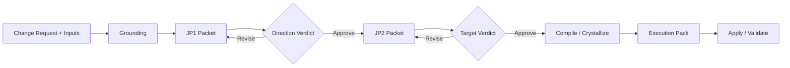
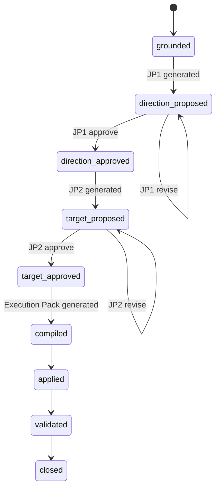
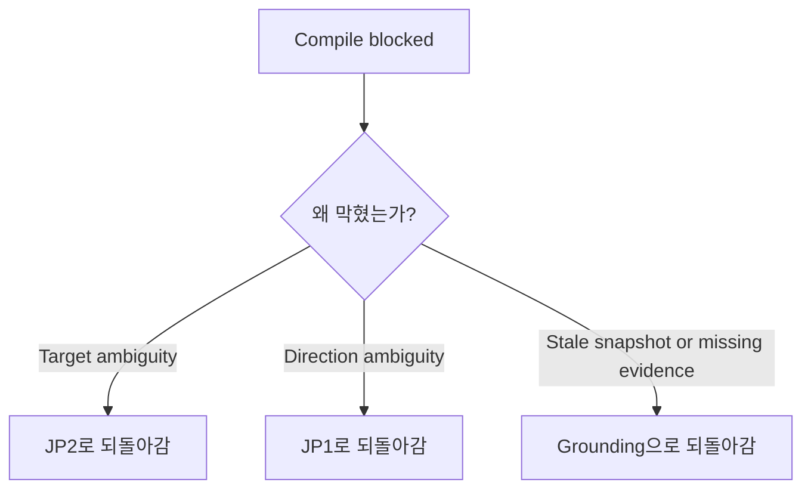

# Judgment Document Flow

## 목적

이 문서는 Sprint Kit의 세 핵심 문서가 어떻게 연결되는지 한 번에 보여주는 개요다.

세 문서는 역할이 다르다.

- `JP1 Packet`: 방향 승인 문서
- `JP2 Packet`: 목표 결과물과 hidden requirement 승인 문서
- `Execution Pack`: 구현 기준 확정 문서

이 셋은 순서대로 생성되며, 앞 단계의 승인 결과가 다음 단계의 입력이 된다.

## 한 줄 요약

`JP1`은 "무엇을 만들 방향인가?"를 묻고,
`JP2`는 "이 결과물이 맞는가?"를 묻고,
`Execution Pack`은 "이걸 어떻게 틀리지 않게 구현할 것인가?"를 정한다.

## 문서 간 관계

## 각 문서가 답하는 질문

### 1. JP1 Packet

이 문서는 방향 판단을 위한 문서다.

답해야 하는 질문:

- 왜 이 변경이 필요한가?
- 어떤 사용자 문제를 해결하려는가?
- 현재 시스템 현실상 이 방향이 타당한가?
- 이번 범위와 제외 범위는 무엇인가?
- 이 상태로 target surface를 만들어도 되는가?

여기서 승인되면:

- 방향이 고정된다
- target surface 설계를 시작할 수 있다

여기서 수정되면:

- 방향 문서를 다시 만든다
- 아직 preview나 contract diff로 넘어가지 않는다

### 2. JP2 Packet

이 문서는 목표 승인과 hidden requirement 결정을 위한 문서다.

답해야 하는 질문:

- preview 또는 contract diff가 진짜 원하는 결과물인가?
- 사용자에게 실제로 어떻게 보이고 동작해야 하는가?
- surface에 보이지 않지만 반드시 반영해야 할 것은 무엇인가?
- 각 hidden requirement를 inject, defer, reject 중 어떻게 처리할 것인가?
- 이 상태로 compile을 시작해도 되는가?

여기서 승인되면:

- target이 고정된다
- hidden requirement 결정이 고정된다
- compile / crystallize를 진행할 수 있다

여기서 수정되면:

- surface와 gap draft를 다시 만든다
- target을 다시 판단한다

### 3. Execution Pack

이 문서는 구현 기준을 고정하는 문서다.

답해야 하는 질문:

- 무엇을 변경해야 하는가?
- 어떤 순서로 구현해야 하는가?
- 정상 동작은 무엇인가?
- 실패/오류 동작은 무엇인가?
- edge case에서 시스템은 무엇을 해야 하는가?
- 어떤 정책과 제약을 반드시 지켜야 하는가?
- 어떤 검증을 통과해야 구현 완료라고 볼 수 있는가?

이 문서가 완성되면:

- 개발자는 다시 제품 판단을 하지 않고 구현할 수 있다
- validator는 이 문서를 기준으로 구현을 검증할 수 있다

## 세 문서의 역할 차이

| 문서 | 주 목적 | 사람이 판단하는 것 | 아직 판단하지 않는 것 |
|------|---------|-------------------|------------------------|
| `JP1 Packet` | 방향 승인 | 문제, 방향, 범위, 시나리오 | 세부 구현, 오류 처리 |
| `JP2 Packet` | 목표 승인 | concrete result, hidden requirement, risk | 파일 단위 구현 순서 |
| `Execution Pack` | 구현 기준 확정 | 사람이 아니라 시스템이 compile 시 확정 | 새로운 제품 판단 |

## 상태 전이 관점

## 누가 무엇을 읽는가

### 제품 전문가

- `JP1 Packet`
- `JP2 Packet`

제품 전문가는 방향과 목표를 판단한다.
구현 상세를 책임지지 않는다.

### 개발자

- `Execution Pack`
- 필요 시 `JP2 Packet` 참조

개발자는 구현을 책임진다.
하지만 제품 방향과 edge case 정책을 새로 결정하지는 않는다.

### 시스템 / Validator

- `Execution Pack`
- `Delta Set`
- `case.md`

시스템은 승인된 기준이 구현 결과와 일치하는지 검증한다.

## 되돌아가는 규칙

즉:

- 방향 문제면 `JP1`로 돌아간다
- 목표 문제면 `JP2`로 돌아간다
- 현실 정보 문제면 grounding으로 돌아간다

## 완료의 의미

Sprint Kit에서 문서가 많아지는 것이 완료가 아니다.

완료는 아래 순서로 정의된다.

1. `JP1`에서 방향이 승인됨
2. `JP2`에서 목표와 hidden requirement 처리가 승인됨
3. `Execution Pack`이 구현 기준을 완전히 고정함
4. apply / validate가 통과함

즉 이 시스템은 문서 작성 시스템이 아니라,
`판단을 받아 실행 가능한 변경으로 수렴시키는 시스템`이다.
